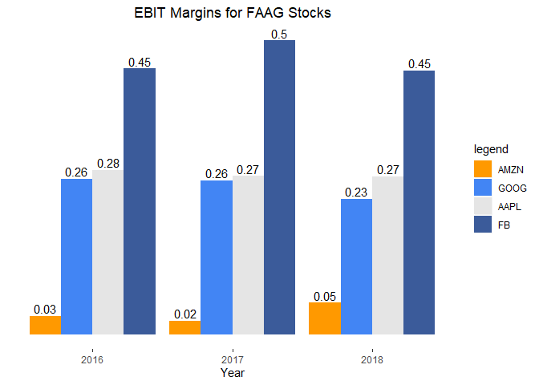

<!-- README.md is generated from README.Rmd. Please edit that file -->

# equityanalysis

<!-- badges: start -->

[](https://travis-ci.org/Ljupch0/equityanalysis)
<!-- badges: end -->

The equityanalysis package simplifies the download and analysis of
financial statement data. The data source is yahoo finance.

## Installation

You can install the released version of equityanalysis from
[Github](https://github.com/Ljupch0/equityanalysis) with:

``` r
devtools::install_github("ljupch0/equityanalysis")
library(equityanalysis)
```

## Introduction

The functions **getIncome**, **getBalanceSheet** and **getCashFlow**
scrape the respective financial statements for a single stock ticker.
**getFinancials** combines these functions and applies them over a
vector of stock tickers.

The resulting dataframes are available in 3 formats. The “raw” format
presents the data as it usually would be seen as a table in a financial
report, and thus is best for readability. The “clean” format keeps that
readable structure, but removes empty grouping rows, and converts
missing data to NA and numbers to numeric. Finally, `format = "tidy"`
pivots the data so that every statement item is a variable, and every
report is an observation, and also shortens the variable names for ease
of use. Most importantly, “tidy” format makes the data ready to be
analyzed and plotted with the tidyverse and beyond, and as such is the
defaut format.

The resulting dataframes are by default assigned to the envirnoment with
succint object names. However, by setting `assign = FALSE` the user is
free to have only the results returned.

**getFinancials** is the most general function, which can take a vector
of tickers and returns a tidy dataframe containing all the income
statement, balance sheet, and cash flow data from the latest 4 yearly
reports.

## Examples

Libraries needed for these examples

``` r
library(equityanalysis)
library(dplyr)
library(ggplot2)
```

To get an income statement that can be read through like a table, use
**getIncome** with `format = "raw"`.

``` r
getIncome(ticker="AAPL", format = "raw", assign = FALSE)
#>                                          Items         TTM   9/29/2019
#> 1                                Total Revenue 259,034,000 260,174,000
#> 2                              Cost of Revenue 160,871,000 161,782,000
#> 3                                 Gross Profit  98,163,000  98,392,000
#> 4                           Operating Expenses                        
#> 5                         Research Development  15,857,000  16,217,000
#> 6           Selling General and Administrative  17,883,000  18,245,000
#> 7                     Total Operating Expenses  33,740,000  34,462,000
#> 8                     Operating Income or Loss  64,423,000  63,930,000
#> 9                             Interest Expense   3,634,000   3,576,000
#> 10             Total Other Income/Expenses Net      76,000     422,000
#> 11                           Income Before Tax  66,031,000  65,737,000
#> 12                          Income Tax Expense  10,336,000  10,481,000
#> 13           Income from Continuing Operations  55,695,000  55,256,000
#> 14                                  Net Income  55,695,000  55,256,000
#> 15 Net Income available to common shareholders  55,695,000  55,256,000
#> 16                                Reported EPS                        
#> 17                                       Basic           -       11.97
#> 18                                     Diluted           -       11.89
#> 19         Weighted average shares outstanding                        
#> 20                                       Basic           -   4,617,834
#> 21                                     Diluted           -   4,648,913
#> 22                                      EBITDA           -  81,860,000
#>      9/29/2018   9/29/2017   9/29/2016
#> 1  265,595,000 229,234,000 215,639,000
#> 2  163,756,000 141,048,000 131,376,000
#> 3  101,839,000  88,186,000  84,263,000
#> 4                                     
#> 5   14,236,000  11,581,000  10,045,000
#> 6   16,705,000  15,261,000  14,194,000
#> 7   30,941,000  26,842,000  24,239,000
#> 8   70,898,000  61,344,000  60,024,000
#> 9    3,240,000   2,323,000   1,456,000
#> 10    -441,000    -133,000  -1,195,000
#> 11  72,903,000  64,089,000  61,372,000
#> 12  13,372,000  15,738,000  15,685,000
#> 13  59,531,000  48,351,000  45,687,000
#> 14  59,531,000  48,351,000  45,687,000
#> 15  59,531,000  48,351,000  45,687,000
#> 16                                    
#> 17       12.01        9.27        8.35
#> 18       11.91        9.21        8.31
#> 19                                    
#> 20   4,955,377   5,217,242   5,470,820
#> 21   5,000,109   5,251,692   5,500,281
#> 22  87,046,000  76,569,000  73,333,000
```

However to get a report that is easier to work with in R, we can use the
`format = "tidy"` and `assign = TRUE` defaults and just provide the
company ticker. In the resulting dataframe we can filter a for a single
yearly report and calculate the EBITDA margin, for instance.

``` r
getIncome("AAPL")
#> [[1]]
#> [1] "AAPL" "AAPL" "AAPL" "AAPL" "AAPL"

aapl_income %>% 
  dplyr::filter(year == "2019") %>% 
  transmute(
    ebitda_margin = ebitda / revenue
  )
#> # A tibble: 1 x 1
#>   ebitda_margin
#>           <dbl>
#> 1         0.315
```

To get all financial data for a group of stocks, we can provide a vector
of tickers to **getFinancials**. Note that getFinancials only returns
tidy data and has no format argument. With the resulting “financials”
dataframe we can calculate profitability ratios using the shortened
variable names, and can plot the results.

``` r
getFinancials(c("FB", "AMZN", "AAPL", "GOOG"))
#> [[1]]
#>  [1] "FB"   "FB"   "FB"   "FB"   "FB"   "AMZN" "AMZN" "AMZN" "AMZN" "AMZN"
#> [11] "AAPL" "AAPL" "AAPL" "AAPL" "AAPL" "GOOG" "GOOG" "GOOG" "GOOG" "GOOG"

profit_margins <- financials %>% 
  dplyr::filter(year=="2016" | year == "2017" | year=="2018") %>% #AAPL has its 2019 report out, others do not.
  mutate(
    gross_margin = gross_profit / revenue,
    ebitda_margin = ebitda / revenue,
    ebit_margin = ebit / revenue,
    net_profit_margin = ni / revenue,
    cash_flow_margin = operating_cf / revenue
  )


ggplot(data = profit_margins)+
  geom_bar(mapping = aes(x = year, y=ebit_margin, fill=reorder(ticker, ebit_margin)),
             stat="identity",
             position = "dodge")+
  geom_text(mapping = aes(x = year, y=ebit_margin, fill=reorder(ticker, ebit_margin), label=round(ebit_margin,2)),
              position = position_dodge(width = 0.9),
              vjust = -0.3)+
  scale_fill_manual("legend", values = c("FB" = "#3b5b9a", "AMZN" = "#ff9900", "GOOG" = "#4285F4", "AAPL" = "#e5e5e5"))+
  labs(title = "EBIT Margins for FAAG Stocks", x ="Year")+
  theme(
    axis.title.y=element_blank(),
    axis.text.y=element_blank(),
    axis.ticks.y=element_blank(),
    panel.grid.major = element_blank(),
    panel.grid.minor = element_blank(),
    panel.background = element_rect("white"),
    plot.title = element_text(hjust = 0.5)
  )
#> Warning: Ignoring unknown aesthetics: fill
```



## Data

The full list of data available and variable name shortcuts.

Income Statement:

``` 
  "revenue"=`Total Revenue`,
  "cost_revenue" = `Cost of Revenue`,
  "gross_profit" = `Gross Profit`
  "rd" = `Research Development`,
  "sga" = `Selling General and Administrative`,
  "operating_expenses" = `Total Operating Expenses`,
  "ebit" = `Operating Income or Loss`,
  "interest_expense" = `Interest Expense`,
  "other_income_net" = `Total Other Income/Expenses Net`,
  "ebt" = `Income Before Tax`,
  "tax" = `Income Tax Expense`,
  "income_operations" = `Income from Continuing Operations`,
  "ni" = `Net Income`,
  "ni_to_shareholders" = `Net Income available to common shareholders`,
  "basic_eps" = `Basic EPS`,
  "diluted_eps" = `Diluted EPS`,
  "basic_w_avg_shares" = `Basic W. Average Shares Outstanding`,
  "diluted_w_avg_shares" = `Diluted W. Average Shares Outstanding`,
  "ebitda" = `EBITDA`
  
```

Balance Sheet:

``` 
  "cash_equivalents" = `Cash And Cash Equivalents`,
  "st_investments" = `Short Term Investments`,
  "total_cash" = `Total Cash`,
  "net_receivables" = `Net Receivables`,
  "inventory" = `Inventory`,
  "other_ca" = `Other Current Assets`,
  "total_ca" = `Total Current Assets`,
  "gross_ppe" = `Gross property, plant and equipment`,
  "accumulated_depreciation" = `Accumulated Depreciation`,
  "net_ppe" = `Net property, plant and equipment`,
  "equity_other_investments" = `Equity and other investments`,
  "goodwill" = `Goodwill`,
  "intangibles" = `Intangible Assets`,
  "other_lta" = `Other long-term assets`,
  "total_lta" = `Total non-current assets`,
  "total_assets" = `Total Assets`,
  "total_revenue" = `Total Revenue`,
  "payables" = `Accounts Payable`,
  "taxes_payable" = `Taxes payable`,
  "accrued_liabilities" = `Accrued liabilities`,
  "other_cl" = `Other Current Liabilities`,
  "total_cl" = `Total Current Liabilities`,
  "lt_debt" = `Long Term Debt`,
  "deferred_taxes" = `Deferred taxes liabilities`,
  "deferred_revenue_lt" = `Deferred revenues`,
  "other_ltl" = `Other long-term liabilities`,
  "total_ltl" = `Total non-current liabilities`,
  "total_liabilities" = `Total Liabilities`,
  "common_stock" = `Common Stock`,
  "retained_earnings" = `Retained Earnings`,
  "accumulated_other_income" = `Accumulated other comprehensive income`,
  "total_equity" = `Total stockholders' equity`,
  "total_liabilities_equity" = `Total liabilities and stockholders' equity`
  
```

Cash Flow Statement:

``` 
  "ni" = `Net Income`,
  "da" = `Depreciation & amortization`,
  "deferred_taxes_change"=`Deferred income taxes`,
  "stock_comp" = `Stock based compensation`,
  "working_capital_change" = `Change in working capital`,
  "receivables_change" = `Accounts receivable`,
  "inventory_change" = `Inventory`,
  "payables_change" = `Accounts Payable`,
  "other_working_capital" = `Other working capital`,
  "other_non_cash" = `Other non-cash items`,
  "operating_cf" = `Net cash provided by operating activites`,
  "ppe_investment" = `Investments in property, plant and equipment`,
  "acquisitions" = `Acquisitions, net`,
  "purchases_investments" = `Purchases of investments`,
  "sales_investments" = `Sales/Maturities of investments`,
  "other_investing" = `Other investing activites`,
  "investing_cf" = `Net cash used for investing activites`,
  "debt_repayment" = `Debt repayment`,
  "stock_issued" = `Common stock issued`,
  "stock_repurchased" = `Common stock repurchased`,
  "dividends_paid" = `Dividends Paid`,
  "other_financing" = `Other financing activites`,
  "financing_cf" = `Net cash used privided by (used for) financing activities`,
  "change_cash" = `Net change in cash`,
  "cash_start_period" = `Cash at beginning of period`,
  "cash_end_period" = `Cash at end of period`,
  "capex" = `Capital Expenditure`,
  "fcf" = `Free Cash Flow`
```
